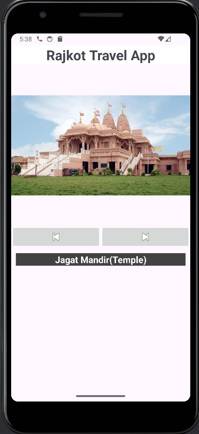

# 🏞️ Rajkot_Travel_App

Welcome to **Rajkot_Travel_App**! 🚀 This is my first Android app, developed with Kotlin, where you can explore five amazing travel destinations in Rajkot, Gujarat, India. 📍

## 🗺️ Travel Places in Rajkot
- **Jagat Mandir (Temple)**
- **Khambhalida Caves**
- **Ranjit Vilas Palace**
- **Ishwariya Park**
- **Padyuman Park (Zoo)**

## 📱 About the App
From this app, you can check the travel places in Rajkot, Gujarat, India. It provides a simple and intuitive interface to navigate through these popular destinations.

## 🛠️ Technology Used
- **Kotlin**: This app is built using Kotlin, a modern and powerful programming language for Android development.

## 📺 Tutorial
I used this [video tutorial](https://youtu.be/WPO7aDJ4DF0?si=oSQNjyT8zRpOxmsf) to learn and develop this application. The tutorial is very comprehensive and helpful for beginners.

## 🌟 Features
- **User-friendly Interface**: Easy to navigate through different travel places.
- **Image Gallery**: View beautiful images of the travel destinations.
- **Details on Places**: Get brief information about each place.

## 📸 Screenshots


## 🚀 Installation
1. Clone the repo:
   ```sh
   git clone https://github.com/yourusername/Rajkot_Travel_App.git

2. Open the project in Android Studio.  
3. Build and run the app on an emulator or physical device.

## 📖 Usage
- Launch the app on your device.
- Use the navigation buttons to browse through the different travel places.
- Enjoy the scenic images and information about each destination.

## 🤝 Contributing
Contributions are what make the open-source community such an amazing place to learn, inspire, and create. Any contributions you make are **greatly appreciated**.

1. Fork the Project.
2. Create your Feature Branch (`git checkout -b feature/AmazingFeature`).
3. Commit your Changes (`git commit -m 'Add some AmazingFeature'`).
4. Push to the Branch (`git push origin feature/AmazingFeature`).
5. Open a Pull Request.


Project Link: [https://github.com/yourusername/Rajkot_Travel_App](https://github.com/yourusername/Rajkot_Travel_App)

---

Thank you for checking out **Rajkot_Travel_App**! ✈️ Happy traveling!

